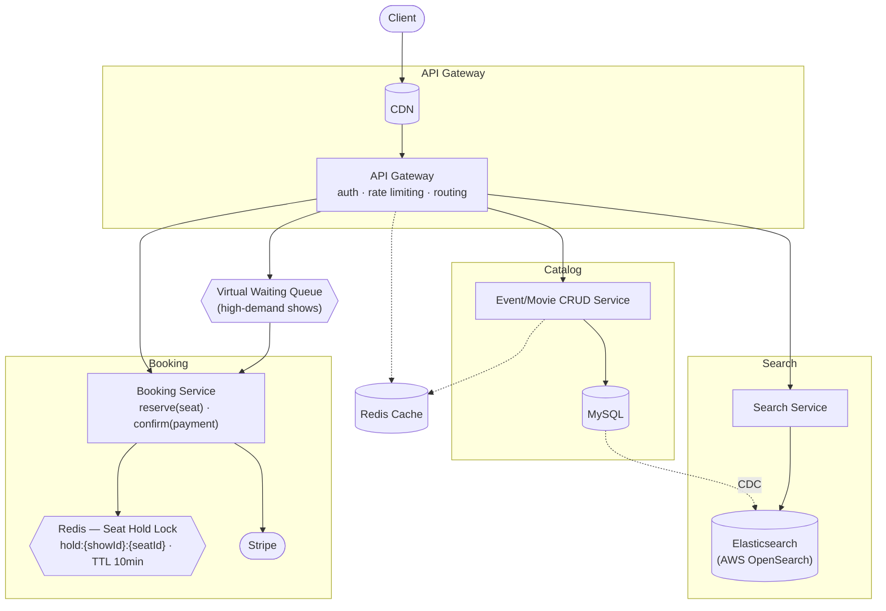
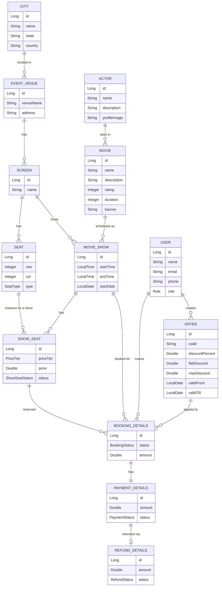

# 🎬 Showza

**A scalable movie & event ticket booking platform** — multi-city, multi-theater, seat-level
booking with concurrency-safe holds, tiered pricing, discounts, payments and configurable
refunds.


---

## Table of Contents

- [Overview](#overview)
- [Features](#features)
- [Roles](#roles)
- [Tech Stack](#tech-stack)
- [Architecture](#architecture)
- [Core Entities & Relations](#core-entities--relations)
- [Project Structure](#project-structure)
- [Getting Started](#getting-started)
- [API Reference](#api-reference)
- [Roadmap](#roadmap)

---

## Overview

Showza lets customers browse shows across cities and theaters, hold seats while they check out,
pay, and manage their bookings — while giving admins full control over the catalog and business
rules (theaters, shows, pricing, refund policies). The system is designed around one hard
constraint: **when multiple users race for the same seat, exactly one booking wins — never two.**

## Features

**Customer**
- Browse cities, theaters and shows (movie + theater + screen + time)
- Select seats on a live seat map and place a time-bound hold
- Apply a discount code, pay, and confirm a booking
- Cancel a booking and receive a refund per the applicable refund policy
- View booking history

**Admin**
- Manage cities, theaters, screens/seat layouts and shows
- Configure pricing tiers (regular / premium / weekend) and refund policies

**Non-functional goals**
- Strong consistency for seat booking — never double-allocate a seat under concurrent requests
- High availability for browse/search (read-heavy: read ≫ write)
- Low-latency show and seat-map lookups
- Booking confirmation/reminder notifications never block the booking flow
- Scales for traffic surges on popular show releases

*Out of scope (for now): payment gateway internals, fraud detection, GDPR compliance.*

## Roles

| Role | Capabilities |
|------|-------------|
| **ADMIN** | Manage cities, theaters, screens, shows, pricing tiers, refund policies |
| **CUSTOMER** | Browse shows, hold/book/cancel seats, view booking history |

## Tech Stack

| Layer | Technology |
|-------|-----------|
| Language | Java 17 |
| Framework | Spring Boot 4.1.1 (Spring Web MVC, Spring Data JPA) |
| ORM | Hibernate |
| Database | MySQL 8 |
| Build | Maven (wrapper included — no local Maven install needed) |

## Architecture

Showza's high-level design: a client goes through an API Gateway (auth, rate limiting, routing,
CDN caching) into three main service areas — catalog (CRUD + MySQL), search (Elasticsearch kept
in sync via CDC), and booking (seat holds via Redis, payment via Stripe, with a virtual waiting
queue in front for high-demand shows).



**Key correctness mechanism:** a seat hold is written to Redis with a short TTL
(`hold:{showId}:{seatId}`). Only the holder can confirm the booking within that window; the DB
transaction that flips a seat to `BOOKED` is conditional on it still being held, so a race between
two customers for the same seat resolves to exactly one winner. Unconfirmed holds expire and free
the seat automatically — no cron job required.

## Core Entities & Relations



## Project Structure

Package-by-feature, with every feature exposing the same four layers:

```
com.Showza
└── swz
    ├── customer/     { model: User, Role                      | repository | service | controller }
    ├── movieVenue/    { model: City, EventVenue                | repository | service | controller }
    ├── movie/         { model: Actor, Movie, MovieShow, Screen,
    │                          Seat, SeatType, ShowSeat,
    │                          ShowSeatStatus                   | repository | service | controller }
    ├── booking/       { model: BookingDetails, BookingStatus   | repository | service | controller }
    ├── offer/         { model: Offer                           | repository | service | controller }
    ├── payment/       { model: PaymentDetails, PaymentStatus   | repository | service | controller }
    ├── pricing/       { model: PriceTier                       }
    └── refund/        { model: RefundDetails, RefundStatus     | repository | service | controller }
```

## Getting Started

### Prerequisites
- Java 17+
- MySQL 8 running locally, with a `showza` database created
- No local Maven install needed — this project ships the Maven wrapper (`mvnw` / `mvnw.cmd`)

### Configure

Update [`src/main/resources/application.properties`](src/main/resources/application.properties)
with your MySQL credentials:

```properties
spring.datasource.url=jdbc:mysql://localhost:3306/showza
spring.datasource.username=<your-username>
spring.datasource.password=<your-password>
```

`spring.jpa.hibernate.ddl-auto=update` is enabled, so tables are created/updated automatically
from the entities on startup — no manual migration needed for local development.

### Run

```bash
./mvnw spring-boot:run
```

The app starts on **port 9090** (configured via `server.port` in `application.properties`).

## API Reference

Every catalog/booking entity exposes standard CRUD under `/api/<resource>`:

| Resource | Base path |
|----------|-----------|
| Users (customers/admins) | `/api/users` |
| Cities | `/api/cities` |
| Venues (theaters) | `/api/venues` |
| Screens | `/api/screens` |
| Seats | `/api/seats` |
| Actors | `/api/actors` |
| Movies | `/api/movies` |
| Movie Shows | `/api/movie-shows` |
| Show Seats | `/api/show-seats` |
| Bookings | `/api/bookings` |
| Offers | `/api/offers` |
| Payments | `/api/payments` |
| Refunds | `/api/refunds` |

Each supports:

```
POST   /api/<resource>        create
GET    /api/<resource>/{id}   read one
GET    /api/<resource>        read all
PUT    /api/<resource>/{id}   update
DELETE /api/<resource>/{id}   delete
```

**Designed booking flow** (search → hold → confirm → payment callback) — next up on the roadmap:

```
GET  /search?term={term}&location={location}&type={type}&date={date}
     -> Partial<MovieDetails>[]

POST /booking/getAvailableSeats?movieShowId={id}
     header: JWT | sessionToken
     -> MovieShow & Seat[]

PUT  /booking/confirm
     header: JWT | sessionToken
     body:  { movieShowId, seatId, transactionId }
     -> BookingDetails

POST /paymentStatus
     body: { transactionId, status, amount }
     (callback endpoint for the payment gateway to confirm payment status)
```

## Roadmap

- [ ] Seat-hold concurrency: wire the Redis `hold:{showId}:{seatId}` TTL lock + conditional
      `HELD → BOOKED` transaction described in [Architecture](#architecture)
- [ ] Multi-seat bookings (a booking currently references a single seat; needs a
      `BookingSeat` join entity)
- [ ] `RefundPolicy` entity (time-before-show based refund rules), separate from the
      `RefundDetails` transaction record
- [ ] Search service backed by Elasticsearch + CDC from MySQL
- [ ] Booking-flow endpoints above (search, hold, confirm, payment callback)
- [ ] Auth/JWT (login, signup, role-based access)
- [ ] Virtual waiting queue for high-demand show releases
